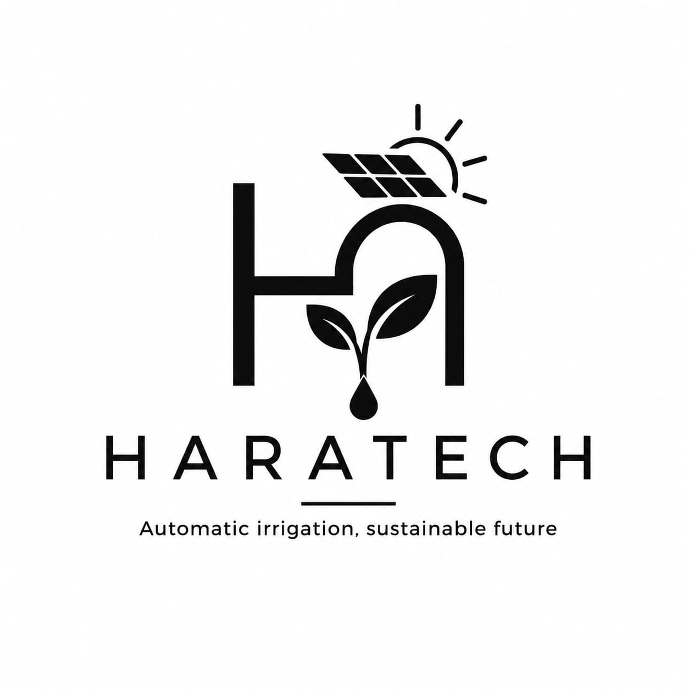

# 🚀 Hara Tech

Sistema de automação e monitoramento desenvolvido utilizando Arduino e ESP32, com foco em irrigação inteligente, monitoramento remoto e integração web.

---

## 📖 Sobre o Projeto

O Hara Tech é uma plataforma de irrigação inteligente desenvolvida utilizando ESP32, com foco em monitoramento remoto, automação e gerenciamento de hortas através da internet.

O sistema combina hardware e software para permitir o controle e acompanhamento de áreas de cultivo em tempo real por meio de uma plataforma web centralizada.

Atualmente o sistema conta com:

* 🌱 Monitoramento da umidade do solo
* 💧 Acionamento automático da irrigação
* 📟 Exibição de informações em LCD 16x2
* 📡 Conectividade Wi-Fi utilizando ESP32
* 🌐 Plataforma web para gerenciamento remoto
* 👤 Sistema de usuários e autenticação
* 🔗 Associação de dispositivos através de código de ativação
* 🪴 Suporte a múltiplas zonas de irrigação
* 📊 Monitoramento e armazenamento de dados

O projeto foi criado com fins educacionais e tecnológicos, visando aplicar conceitos de eletrônica, programação, automação, desenvolvimento web e Internet das Coisas (IoT).

---

## ✨ Funcionalidades

### Sistema Embarcado

* Leitura da umidade do solo
* Controle automático da irrigação
* Controle de bomba d'água
* Exibição de informações em LCD
* Conexão Wi-Fi
* Configuração de rede através de portal próprio
* Comunicação com API via HTTP REST

### Plataforma Web

* Cadastro e autenticação de usuários
* Gerenciamento de dispositivos
* Associação de dispositivos à conta do usuário
* Monitoramento remoto
* Visualização das leituras dos sensores
* Controle remoto da irrigação
* Gerenciamento de múltiplos dispositivos
* Gerenciamento de múltiplas zonas de irrigação

---

## 🔧 Componentes Utilizados

### Hardware

* ESP32
* Sensor de Umidade do Solo
* LCD 16x2
* Módulo Relé
* Bomba de Água
* Protoboard
* Jumpers

### Software

* Arduino IDE
* C++
* Node.js
* Express
* PostgreSQL
* Prisma ORM
* TypeScript
* HTML
* CSS
* JavaScript

---

## 📂 Estrutura do Projeto

```text
HaraTech/
│
├── ESP32/
│   ├── haratech_code.ino
│   ├── web_server.ino
│   └── paginas_web/
│
├── Imagens/
│   ├── esquema.png
│   ├── montagem.jpg
│   └── sistema_web.png
│
├── Documentacao/
│
├── LICENSE
│
└── README.md
```

---

## 📈 Histórico de Desenvolvimento

### v0.1 - Versão Inicial

* Leitura do sensor de umidade
* Controle automático da bomba
* Exibição da umidade no LCD 16x2
* Implementação inicial do sistema de irrigação

### v0.2 - Plataforma Conectada

* Migração completa para ESP32
* Comunicação via Wi-Fi
* Estrutura da API central
* Sistema de usuários
* Associação de dispositivos
* Estrutura para múltiplas zonas de irrigação
* Desenvolvimento da plataforma web


---

## 📜 Licença

Este projeto está licenciado sob a licença Creative Commons Attribution-NonCommercial 4.0 International (CC BY-NC 4.0).

✔ Uso educacional permitido

✔ Compartilhamento permitido

✔ Modificações permitidas

❌ Uso comercial proibido sem autorização prévia dos autores

https://creativecommons.org/licenses/by-nc/4.0/

---

## 🎯 Objetivo

Demonstrar a aplicação prática da programação, eletrônica e automação na solução de problemas reais, integrando hardware e software em uma única plataforma tecnológica.

---

<div align="center">

### Hara Tech

Tecnologia, Automação e Inovação.

</div>


<font dir="auto" style="vertical-align: inherit;"><font dir="auto" style="vertical-align: inherit;">Esta obra está licenciada sob a Licença </font></font><a href="https://creativecommons.org/licenses/by-nc/4.0/"><font dir="auto" style="vertical-align: inherit;"><font dir="auto" style="vertical-align: inherit;">Internacional Creative Commons Atribuição-NãoComercial 4.0.</font></font></a>
